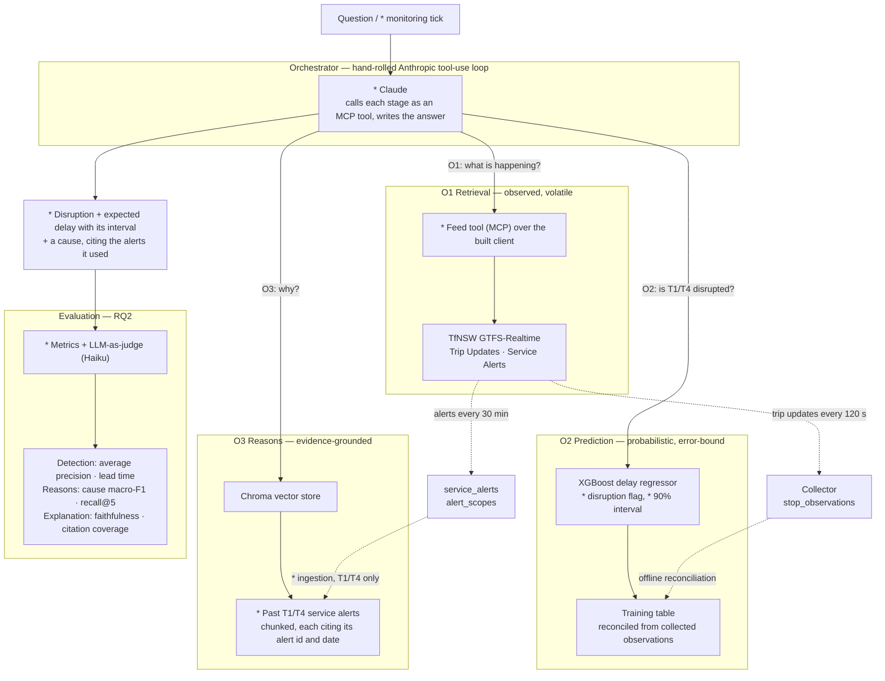

# Architecture

> One orchestrator, three workflow stages — retrieve, predict, explain — and the
> evaluation that scores each of them separately.

## 1. The big picture

> **Built vs planned.** Solid boxes with a `*` are **not built yet** as of
> 2026-09-24: the orchestrator, the MCP tools, the alert corpus and its ingestion,
> the disruption flag, the 90% interval, and the evaluation harness. What exists is
> collection, reconciliation, the delay regressor, and a retrieval stack currently
> indexing the Opal PDFs. [`04-implementation-plan.md`](./04-implementation-plan.md)
> has the status table.



## 2. Why three stages and not one

The stages make different *kinds* of claim, and conflating them is the failure the
evaluation is built to catch:

| Stage | Claim type | What "correct" means | Failure mode it introduces |
| --- | --- | --- | --- |
| O1 Retrieval | "The T1 is 6 minutes late" | Matches what the feed returned at call time | Staleness — a true-then, false-now answer |
| O2 Prediction | "T1 is likely disrupted; ~5 min late" | Carries an interval that holds at its nominal rate | **Overclaiming** — stating a forecast as fact |
| O3 Reasons | "Probably a signalling fault" | Every statement traces to a retrieved alert | Classic hallucination — an invented cause |

This is why each stage is scored separately rather than the workflow being scored
end to end: a correct answer reached through a fabricated reason is not a success,
and an end-to-end score cannot tell the two apart.

**Hard requirement on the orchestrator:** any answer resting on the prediction model
must state the interval the tool returned, unnarrowed. This is an evaluated property,
not a nicety.

## 3. Repository layout

```
src/transit_rag/
  config.py                    Environment-driven settings. Stdlib only — the
                               collector must not need the model stack to run.
  ingestion/                   documents -> chunks carrying source + locator
  retrieval/                   Voyage embeddings -> persisted Chroma collection
  realtime/
    client.py                  HTTP access to the TfNSW GTFS-R endpoints
    parsing.py                 Pure feed -> observation transforms (unit tested)
  prediction/
    collection/
      poller.py                The unattended collector (loop / --once / --status)
      routes.py                route_id -> line-name lookup from the static bundle
      store.py                 Two sinks: upserting SQLite, or CSV snapshots
    features/                  (next) reconciliation + feature engineering
    model/                     (next) XGBoost training and inference
  agent/                       The hand-rolled tool-use loop
  mcp_server/                  MCP tool interface + FastAPI surface
  evaluation/                  Ragas + custom LLM-as-judge harness

tests/                         Mirrors src/. Live-API tests are marked `live`
                               and skipped by default.
docs/                          These documents
data/                          Gitignored. Downloaded bundles, collected SQLite
models/                        Gitignored. Serialized model artefacts
```

`realtime/` sits above `prediction/` in the dependency order on purpose: the
collector and the agent's live tools read the same feeds, so they share one client
and one parser rather than drifting into two subtly different interpretations of
the same protobuf.

## 4. Conventions

- **Python ≥ 3.12**, `from __future__ import annotations` in every module.
- **Ruff** for lint and format (line length 100); **mypy** with `disallow_untyped_defs`.
- **Pure functions get unit tests; I/O gets a thin wrapper.** `realtime/parsing.py`
  is testable against a synthetic `FeedMessage`; `realtime/client.py` is a shell
  around `requests` with one error type.
- **Config is read from the environment, never hardcoded.** Relative paths resolve
  against the project root, not the working directory — cron and systemd units do
  not run from the repo.
- **Comments explain *why*.** The *what* is in the code.
- **Tests that hit a real API are marked `live`** and excluded from the default run,
  so CI never depends on a TfNSW key.

## 5. Data model — collection

### What gets kept, and why so little

The Trip Update feed republishes a prediction for **every** stop each active trip
has not yet reached — twenty-odd rows per trip, nearly all of them a distant guess
that will be revised many times before it matters. Stored naively at a 2-minute
cadence across T1 and T4, that is on the order of **1M rows a day**: several GB over
a collection window, slow to reconcile, and impossible to commit anywhere.

Only the **imminent** stops are close enough to the event to serve as an outcome
proxy. The collector keeps the first `POLLER_MAX_UPCOMING_STOPS` (default 3) per
trip per poll — three rather than one so a trip can pass two stops between polls
without the middle one going unrecorded. `stops_ahead` is stored alongside each row
so a later analysis can weight or filter on how close to the event a prediction was
made, rather than trusting all rows equally.

**The two sinks count different things, and it matters when reading a volume
check:**

| | Rate | What a row is |
| --- | --- | --- |
| CSV snapshots (5-min schedule) | ~60k rows/day, ~5 MB/day | One observation per poll — the same stop appears in several |
| SQLite (2-min loop) | ~25k rows/day | One row per *stop event*, upserted — the deduplicated count |

So the CSV figure is raw throughput and the SQLite figure is distinct stop events;
the second is the one that bounds the training set. Both are far below the ~1M/day
the unfiltered feed would produce.

### What the tracked lines actually resolve to

One line is many `route_id`s. From the live bundle: **T1** spans eight
(`NSN_1a`, `NSN_2a`, `NSN_2i`, `NSN_2k`, `WST_1a`, `WST_1b`, `WST_2c`, `WST_2d` —
North Shore and Western), **T4** twelve (`ESI_1a` … `ESI_2f` — Eastern Suburbs &
Illawarra: Bondi Junction, Waterfall, Cronulla, City Circle). Anything reporting
per-line figures has to sum across them.

Two route_ids carry no line name at all: `RTTA_DEF` is *Out Of Service* and
`RTTA_REV` is *Non Revenue* — empty-train movements, not services. They resolve
against the bundle (so they are not a version mismatch) but never match a tracked
line, and are excluded by design. Overnight they can outnumber real services;
`--probe` counts them separately so that does not read as a broken filter.

Worth noting for the training set: a service diverted or altered in ways the
scheduled timetable cannot express may be published under `RTTA_*` rather than its
line. Those trips are not collected. The effect on coverage has not been measured,
and should be before the model's scope is written up.

### Two sinks, because collection runs in two places

| Sink | Used by | Shape |
| --- | --- | --- |
| `SqliteObservationStore` | A long-running process with its own state | **Upserts** one row per `(service_date, trip_id, stop_id)`, holding the latest value |
| `CsvSnapshotStore` | A stateless scheduled run with only a repo to append to | One **immutable** CSV per poll, partitioned by date |

Both satisfy the `ObservationSink` protocol, so the poller does not know which it
was handed.

**Why upsert rather than append:** GTFS-Realtime reports delay only for stops a trip
has not yet reached. Once a vehicle passes a stop, that stop leaves the feed — so
the *last* value seen for a stop event is the closest available proxy for what
actually happened. Storing only that value makes the table the training shape
directly, and makes reconciliation nearly free. The upsert is guarded on
`last_seen_utc`, so a poll that arrives late after a retry cannot overwrite a newer
prediction with an older one.

**Why immutable files rather than one growing file:** a scheduled runner commits its
output to git. A file that is only ever *added* is stored once; a file rewritten
every few minutes stores a fresh copy of its entire contents in history each time.
The upsert then happens during reconciliation, by taking the last snapshot that
mentions each stop event — the same result, computed later.

**`service_date` and `stop_sequence` are both part of the key.** Trip ids repeat
daily, so without the date each day would overwrite the last. And a T1 service
running via the City Circle calls at the same `stop_id` twice in one trip — two
distinct stop events — so the sequence has to be in the key too. It is stored
`NOT NULL` with a `-1` sentinel because SQLite treats NULLs in a composite key as
distinct from one another, which would silently switch deduplication off rather
than merging rows.

`service_date` comes from the trip's GTFS `start_date`. When that is absent it is
derived from the poll instant in **Sydney local time, offset back three hours**.
Midnight is the wrong boundary twice over: a UTC rollover lands mid-morning, and
even a local-midnight rollover disagrees with GTFS for every after-midnight trip
(a service departing 23:50 keeps the previous day's `start_date`). Three hours puts
the boundary in the service gap, so the derived date and the reported one agree.

CSV snapshots are partitioned by that same service day, so one service date never
scatters across two directories.

### `poll_log`

One row per poll attempt: entities seen, rows written, and status (`ok`, or
`error: …`). This table exists because the dangerous failure is not a crash but a
collector running happily for a week while every request 401s. `transit-poller
--status` reads it and says so in as many words when every recent poll failed.
