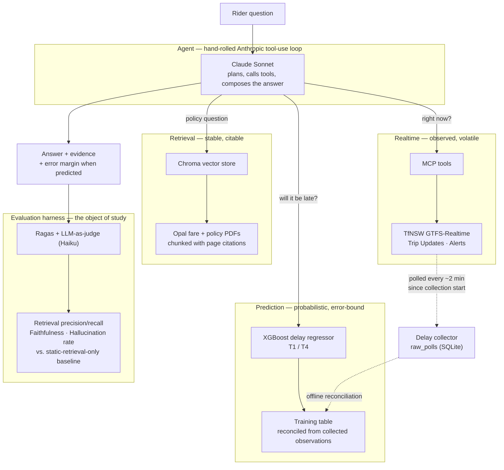

# Architecture

> One agent, three evidence sources with different trust properties, and a harness
> that scores whether the agent's answers stay honest about which is which.

## 1. The big picture



## 2. Why three components and not one

The three sources are not interchangeable, and the distinction is the whole point
of the research question:

| Component | Claim type | What "faithful" means | Failure mode it introduces |
| --- | --- | --- | --- |
| Retrieval | "The policy says X" | The claim appears in a retrieved passage | Classic hallucination — an unsupported claim |
| Realtime | "The T1 is 6 minutes late" | The claim matches what the feed returned at call time | Staleness — a true-then, false-now answer |
| Prediction | "It'll likely be ~5 minutes late" | The claim carries an error margin consistent with the model's measured MAE | **Overclaiming** — stating a forecast as fact |

Existing faithfulness frameworks only handle the first row. The third row is the
contribution: an answer that says "your train will be 5 minutes late" when the
model's MAE is ±4 minutes is *unfaithful* even if the number happens to be right.

**Hard requirement on the agent:** any answer resting on the prediction model must
state the error margin. This is an evaluated property, not a nicety.

## 3. Repository layout

```
src/transit_rag/
  config.py                    Environment-driven settings. Stdlib only — the
                               collector must not need the model stack to run.
  ingestion/                   Opal PDFs -> chunks carrying document + page
  retrieval/                   Voyage embeddings -> persisted Chroma collection
  realtime/
    client.py                  HTTP access to the TfNSW GTFS-R endpoints
    parsing.py                 Pure feed -> observation transforms (unit tested)
  prediction/
    collection/
      poller.py                The unattended collector (loop / --once / --status)
      routes.py                route_id -> line-name lookup from the static bundle
      store.py                 Append-only SQLite: raw_polls + poll_log
    features/                  (next) reconciliation + feature engineering
    model/                     (next) XGBoost training and inference
  agent/                       The hand-rolled tool-use loop
  mcp_server/                  MCP tool interface + FastAPI surface
  evaluation/                  Ragas + custom LLM-as-judge harness

tests/                         Mirrors src/. Live-API tests are marked `live`
                               and skipped by default.
docs/                          These documents
data/                          Gitignored. Downloaded bundles, collected SQLite
models/                        Gitignored. Serialized model artefacts
scripts/                       One-off operational scripts
```

`realtime/` sits above `prediction/` in the dependency order on purpose: the
collector and the agent's live tools read the same feeds, so they share one client
and one parser rather than drifting into two subtly different interpretations of
the same protobuf.

## 4. Conventions

- **Python ≥ 3.11**, `from __future__ import annotations` in every module.
- **Ruff** for lint and format (line length 100); **mypy** with `disallow_untyped_defs`.
- **Pure functions get unit tests; I/O gets a thin wrapper.** `realtime/parsing.py`
  is testable against a synthetic `FeedMessage`; `realtime/client.py` is a shell
  around `requests` with one error type.
- **Config is read from the environment, never hardcoded.** Relative paths resolve
  against the project root, not the working directory — cron and systemd units do
  not run from the repo.
- **Comments explain *why*.** The *what* is in the code.
- **Tests that hit a real API are marked `live`** and excluded from the default run,
  so CI never depends on a TfNSW key.

## 5. Data model — collection

Two tables, both append-only.

**`raw_polls`** — one row per (poll instant, trip, stop). Primary key
`(poll_time_utc, trip_id, stop_id)`, so a retried poll replaces rather than
duplicates.

**`poll_log`** — one row per poll attempt: entities seen, rows written, and status
(`ok`, or `error: …`). This table exists because the dangerous failure is not a
crash but a collector that runs happily for a week while every request 401s.
`transit-poller --status` reads it.

**Why raw polls and not final delays:** GTFS-Realtime reports delay only for stops
a trip has not yet reached. Once a vehicle passes a stop, that stop leaves the
feed. So the last observation naming a given `(trip_id, stop_id)` is the closest
available proxy for the observed outcome. Collapsing `raw_polls` into one row per
completed stop event is an **offline** step run once the collection window closes —
deliberately not in the hot path, so a bug in reconciliation never costs collected
data.
